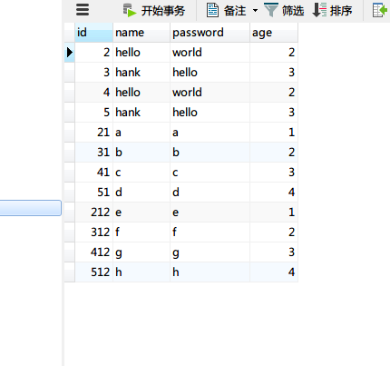
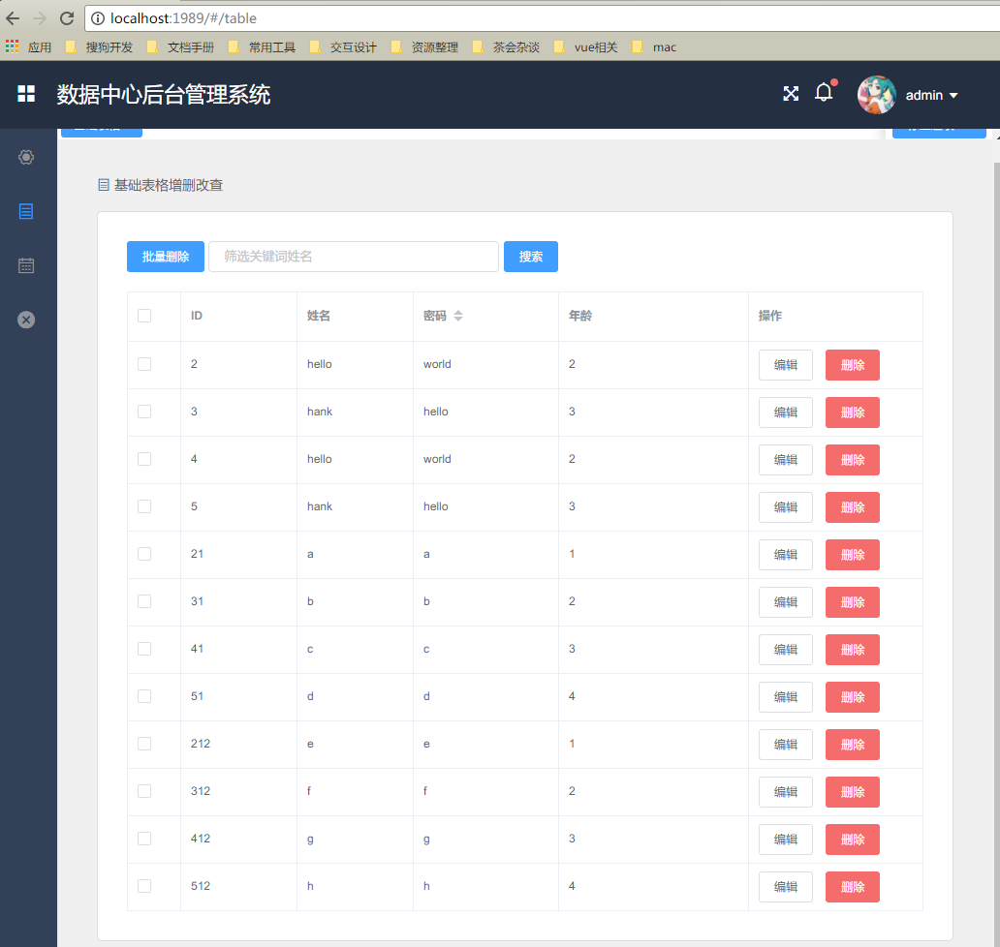

# datacenter-frontend

## 项目介绍

数据中心管理后台界面,和前面的那个backend配合使用，那个提供数据，这个提供界面，非常好用的增删改查

数据库数据

后台界面

功能演示

## 安装步骤

	git clone https://git.sogou-inc.com/ps-front/datacenter-frontend.git    // 把模板下载到本地
	cd datacenter-frontend   // 进入模板目录
	npm install         // 安装项目依赖，等待安装完成之后

## 本地开发 

	// 开启服务器，浏览器访问 http://localhost:1989
	npm run dev

## 构建生产

	// 执行构建命令，生成的dist文件夹放在服务器下即可访问
	npm run build
	
## 特别说明
	// 里面接口请求的数据代理到上个项目datacenter-backend http://localhost:1990
	因此如果你本地需要配置到别的地方，记得要修改啊